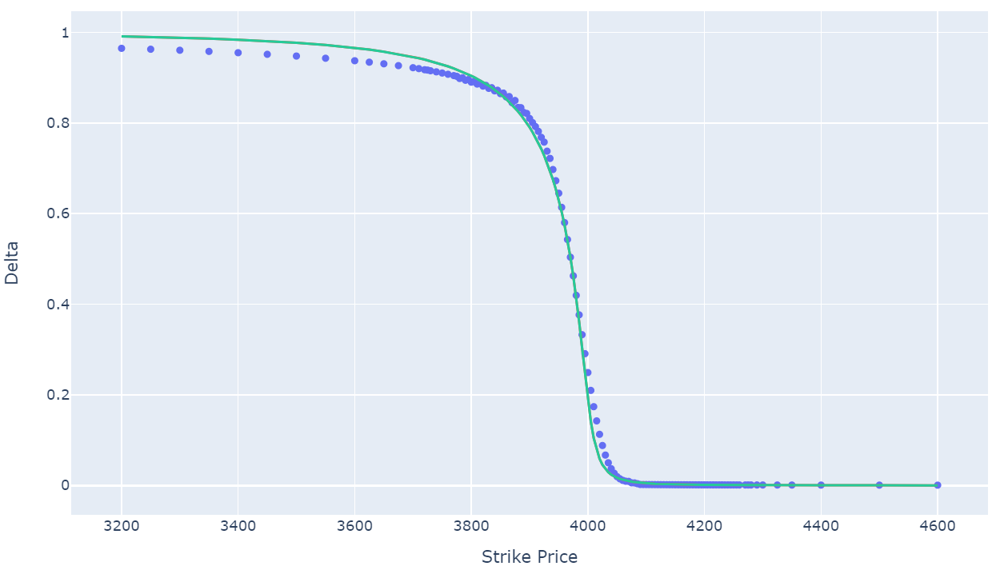
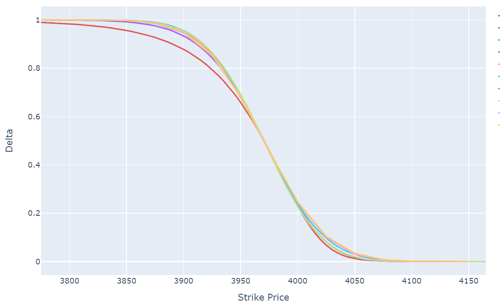
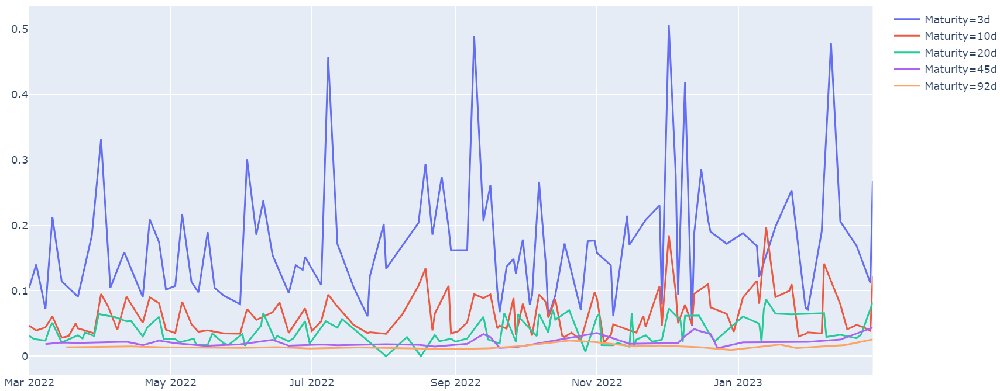
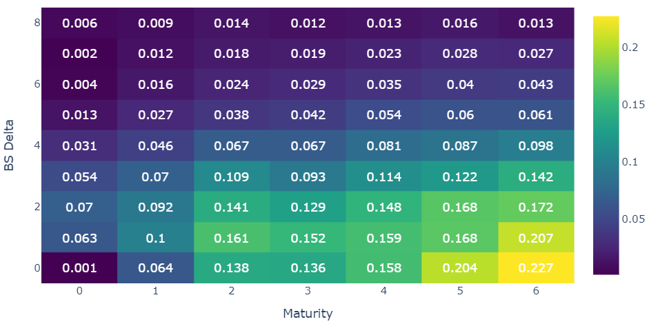
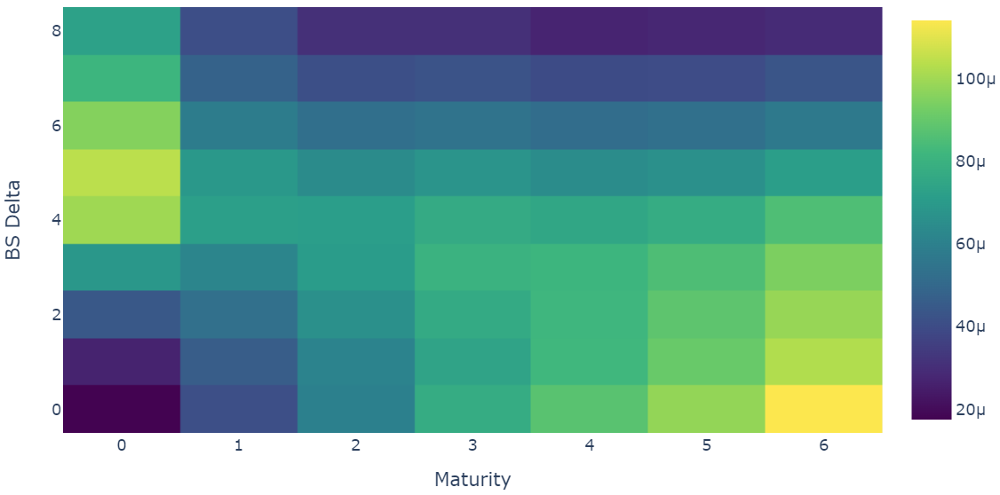

# Optimal-Hedging
 
In this project we implement optimal delta hedging in Hull and White (2016) using the industry-famous stochastic volatility model, the SABR model. The SABR model is calibrated to real SPX 500 options data and the performance of the delta hedging strategy is evaluated.

## Scripts
- `data`: SPX 500 options data from 2023-02-01 to 2023-02-28 from WRDS
- `papers`: a list of papers used for this project, mostly on the Bartlett's delta from Hagan (2020) and Optimal Delta Hedging from Hull and White (2016)
- `presentation`: presentation slides for the project
- `sabr_calibration`: an example of SABR model implementation and calibration 
- `optimal_hedging`: main notebook that implements SABR model calibration, optimal delta hedging, and hedging performance evaluation

## Overview

Recall the SABR model is given by
\begin{align*}
dF(t) &= \sigma(t)(F(t)+\theta)^{\beta}dW_1(t), F(0)=f\\
d\sigma(t) &= \nu\sigma(t)dW_2(t), \sigma(0)=\sigma_0\\
\end{align*}

where $W_1(t)$ and $W_2(t)$ are two correlated Wiener processes with correlation $\rho$, namely, $dW_1(t)dW_2(t) = \rho dt$.

- F: forward rate
- $\sigma$: volatility of forward rate
- $\nu$: volatility of volatility (volvol)
- $\theta$: shift parameter to avoid negative rates

Implied volatility smile calibration

### SABR Delta and Bartlett's Delta

The SABR delta is given by
$$\Delta^{\text{SABR}} = \frac{\partial B}{\partial F} + \frac{\partial B}{\partial \sigma}  \frac{\partial \sigma_{\text{imp}}}{\partial F}  $$

The Bartlett's delta further incorporates the adjustment for the implied volatility skew

$$\Delta^{\text{Bartlett}} = \frac{\partial B}{\partial F} + \frac{\partial B}{\partial \sigma} \left( \frac{\partial \sigma_{\text{imp}}}{\partial F} + \frac{\partial \sigma_{\text{imp}}}{\partial \sigma} \frac{\rho \alpha}{C(F_t)}\right) $$

It is shown in Hagan (2019) that the Bartlett's delta is the optimal delta for hedging in the SABR model, which can be approximated by
$$\Delta^{mod}\approx \Delta^{BS}+\text{Vega}^{BS}\times \eta$$

BS delta (blue dot), SABR delta (red), and Bartlett's delta (green):

Bartlett's delta for different maturities:

### Optimal Delta Hedging and Hedging Gain

Hedging parameter evolution for different maturity options (maturity increases from top to bottom):

In Hull, J., and White (2016), the effectiveness of a hedge is measured by the $Gain$ metric, defined as the percentage reduction in the sum of squared residuals resulting from the hedge, i.e.
$$\text{Gain} = 1- \cfrac{\sum(\Delta f  - \delta_{\text{SABR}}\Delta S)^2}{\sum(\Delta f  - \delta_{\text{BS}}\Delta S)^2}$$

Hedging gain for Bartlett's delta:

### SABR Delta vs. Bartlett's Delta

The relative of Bartlett’s delta to SABR delta is shown below:

## Short Conclusion
- The SABR model calibrates the implied volatility smile of SPX 500 options data extremely well.
- Both SABR delta and Bartlett’s delta are effective in hedging the options, performing much better than the Black-Scholes delta.
- Bartlett’s delta performs slightly but consistently better than SABR delta. 
