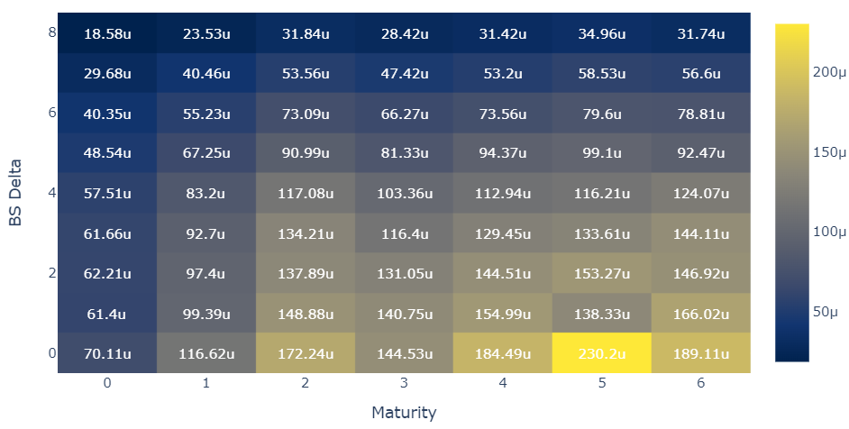

# Optimal-Hedging
 
In this project we Optimal delta hedging implementation using SABR model

## Scripts
Two notebooks are provided for the implementation of the SABR model and the optimal delta hedging strategy:
- `sabr_calibration`: Example of SABR model implementation and calibration 
- `optimal_hedging`: Implementation of the SABR model calibration, optimal delta hedging, and hedging performance evaluation for real SPX 500 options data

## Backtesting
#### Spread Portfolios

## Note
- Higher the transaction costs, larger the optimal entry points for arbitrage, lower the trading frequency.
- Sensitivity analysis needs to be conducted with respect to the level of transaction costs (price impact, bid-ask spread, and commission fees).
